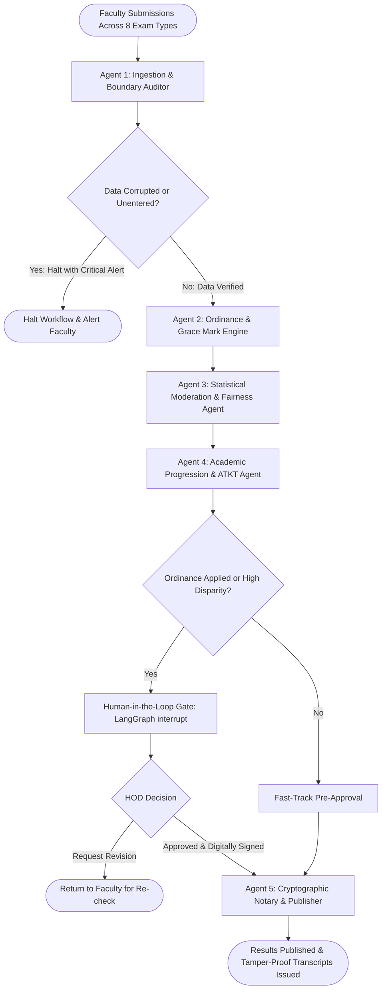

# Autonomous Result Generation & Examination Board System
## Multi-Agent Architecture Specification (LangChain & LangGraph)

---

## 1. Executive Summary & System Vision

The **Autonomous Examination Board & Result Generation System** is an Agentic AI architecture designed for autonomous engineering institutions (SPPU curriculum framework). Built using **LangGraph** and **LangChain**, it replaces manual spreadsheet tabulation and brittle single-pass scripts with a coordinated team of specialized agents operating over a shared state graph.

The system mirrors a real-world University Examination Board:
- It audits multi-exam data integrity across 8 evaluation formats.
- It applies statutory college condonation rules (Ordinance 0.4 / Grace Marks).
- It detects cross-division evaluator leniency or harshness through statistical moderation.
- It determines student academic progression (Clear, ATKT, Detained).
- It pauses for Human-in-the-Loop (HOD/Dean) digital authorization before cryptographically notarizing and publishing the results.

---

## 2. Global Agentic State Definition

The multi-agent graph operates on an immutable, shared blackboard (`ExaminationState`). Every node inspects this state, appends its findings, and updates execution flags.

```
+--------------------------------------------------------------------------------+
|                             EXAMINATION STATE                                  |
+--------------------------------------------------------------------------------+
|  IDENTIFIERS:                                                                  |
|    - Academic Year (e.g., "2025-26")                                           |
|    - Semester Index (1 to 8)                                                   |
|    - Subject Registry ID & Subject Code (e.g., "CE602")                        |
|    - Target Cohort / Division ("TE Comp 1", "TE Comp 2", "ALL")                |
|                                                                                |
|  DATA COLLECTIONS:                                                             |
|    - Raw Exam Matrix (8 Exam Types per Enrolled Student)                       |
|    - Audit Flag Registry (Out-of-range, Unentered, Discrepancies)              |
|    - Condonation Dossier (Ordinance 0.4 Grace Mark Allocations)                |
|    - Evaluator Distribution Metrics (Mean, StdDev, Skewness per Division)      |
|    - Academic Standing Registry (Credits Earned, Failed Credits, ATKT Status)  |
|    - Finalized Grade Ledger (Letter Grades, Grade Points, SGPA, CGPA)          |
|                                                                                |
|  GOVERNANCE & EXECUTION:                                                       |
|    - Human Intervention Required Flag (Boolean)                                |
|    - Execution Halt Reason (Missing Marks / Disparity Spike)                   |
|    - HOD Digital Signature & Authorization Token                               |
|    - Workflow Lifecycle Status (Validating -> Moderating -> Paused -> Locked)  |
+--------------------------------------------------------------------------------+
```

---

## 3. Multi-Agent Graph Topology & Workflow

The architecture is modeled as a directed acyclic state graph with a conditional human-in-the-loop interruption gate.



---

## 4. Detailed Agent Specifications & Responsibilities

### Agent 1: Ingestion & Boundary Auditor (Input Sanity)
* **Role:** Acts as the chief scrutiny clerk. Eliminates data entry anomalies before mathematical compilation begins.
* **Core Logic:**
  - **Ceiling Enforcement:** Enforces maximum bounds per exam type:
    - Continuous Internal Evaluation (UT1, UT2, Mocks): $\le 20$ / $30$
    - In-Sem Theory Examination: $\le 30$
    - End-Sem Theory Examination: $\le 70$
    - Term Work (Lab / Seminar): $\le 25$ / $50$
    - Practical / Oral Examination: $\le 25$ / $50$
  - **Absentee Disambiguation:** Differentiates between a legitimate absence (`is_absent = true` $\rightarrow$ marks set to 0) and an unentered record (`marks = null`, `is_absent = false`). If any unentered cell exists, the agent halts the pipeline and identifies the missing student roll numbers.
  - **Duplicate Check:** Validates that no student appears multiple times in the same exam sitting.

---

### Agent 2: University Ordinance & Grace Mark Engine (Condonation)
* **Role:** Automates statutory college passing rules, removing subjective manual tampering.
* **Core Logic (SPPU / Autonomous Ordinance 0.4):**
  - Identifies students who fall in the marginal failure zone:
    $$\text{Theory Aggregate} = \text{In-Sem} + \text{End-Sem}$$
    $$\text{Condition: } 37 \le \text{Theory Aggregate} \le 39 \quad (\text{Pass Threshold} = 40)$$
  - **Eligibility Checks:**
    1. The student must have passed all remaining theory and practical heads of passing in the semester.
    2. The required points ($\Delta = 40 - \text{Theory Aggregate}$) must not exceed the subject ceiling of $3\text{ marks}$.
    3. The total grace awarded across all subjects in the semester must not exceed $1\%$ of the total semester aggregate.
  - **State Transformation:** If eligible, awards the delta, marks grade as `'P'` (Pass), and generates an audit log entry: `"AWARDED_ORDINANCE_0.4_GRACE"`.

---

### Agent 3: Statistical Moderation & Fairness Agent
* **Role:** Protects students from evaluator disparity across multiple class divisions.
* **Core Logic:**
  - Computes descriptive statistics for each division:
    - Mean score ($\mu$)
    - Standard deviation ($\sigma$)
    - Interquartile Range (IQR)
    - High-score clustering ratio (percentage of students receiving $\ge 80\%$)
  - **Disparity Heuristic:**
    - If Division A average is $51.2$ and Division B average is $66.4$ ($|\Delta\mu| > 12\text{ marks}$), the agent flags an **Evaluator Bias Warning**.
    - If standard deviation is $< 4.0$ (extreme grade compression), flags an **Artificially Flat Grading Anomaly**.
  - **Action:** Generates an executive comparison report for the HOD containing a side-by-side distribution breakdown and recommendations for universal moderation curves if needed.

---

### Agent 4: Academic Progression & ATKT Classifier
* **Role:** Evaluates credit accumulation and advancement rules.
* **Core Logic:**
  - Evaluates individual subject outcomes:
    - $\text{Grade} \ne \text{'F'} \rightarrow \text{EarnedCredits} = \text{SubjectCredits}$
    - $\text{Grade} = \text{'F'} \rightarrow \text{EarnedCredits} = 0, \quad \text{BacklogCredits} += \text{SubjectCredits}$
  - **Progression Status Matrix:**
    - $\text{BacklogCredits} = 0 \rightarrow$ **PROMOTED (Clear Pass)**
    - $0 < \text{BacklogCredits} \le 12 \rightarrow$ **PROMOTED WITH ATKT** (Allowed to Keep Term to next academic year)
    - $\text{BacklogCredits} > 12$ OR unresolved Second Year (SE) backlogs while entering Final Year (BE) $\rightarrow$ **YEAR DOWN / DETAINED (Critical Progression Gate)**

---

### Agent 5: Cryptographic Notary & Publication Agent
* **Role:** Seals results with immutable verification before public release.
* **Core Logic:**
  - Runs final SGPA and CGPA computation using SPPU credit-weighted rollup.
  - Generates a **Cryptographic Digest**:
    $$\text{Payload} = \{\text{Student Roll}, \text{Semester}, \text{SGPA}, \text{CGPA}, \text{Earned Credits}, \text{Timestamp}\}$$
    $$\text{Digest} = \text{SHA-256}(\text{Payload})$$
  - Digitally signs the digest using the Institution's **Ed25519 Private Key**.
  - Encodes the signature and verification URL into a **Dynamic Verification QR Code**.
  - Commits the batch update in PostgreSQL with status `'published'` inside a single atomic database transaction.

---

## 5. Human-in-the-Loop (HITL) Governance Protocol

Autonomous systems in education must never publish grades without authorized human oversight.

```
       [Agent Workflow Executes Nodes 1 to 4]
                         │
                         ▼
        State: requiresHODIntervention = true
                         │
                         ▼
    ============================================
    LANGGRAPH INTERRUPT: WORKFLOW SUSPENDS STATE
    ============================================
                         │
                         ▼
             [HOD Executive Dashboard]
     Displays:
       - Total Candidates Audited: 240
       - Ordinance 0.4 Cases: 5 Students
       - Critical ATKT Detentions: 2 Students
       - Division Disparity Alert: CE602 (Compiler Design)
                         │
         ┌───────────────┴───────────────┐
         ▼                               ▼
    [Request Recount / Review]    [Authorize & Sign]
         │                               │
         ▼                               ▼
  Workflow Aborted               Workflow Resumes with
  Audit Log: "HOD_REJECTED"      HOD Session JWT & Private Key
                                         │
                                         ▼
                                   [Node 5 Executes]
```

### Checkpointing & Recovery
* **State Persistence:** LangGraph's PostgreSQL checkpointer saves the entire execution state graph into a dedicated schema (`agent_checkpoints`).
* **Resumption:** When the HOD clicks "Authorize & Sign" on the web dashboard, Express sends a resume signal (`Command({ resume: approvalPayload })`). The graph loads the snapshot from PostgreSQL and transitions to Node 5 without re-running prior analysis.

---

## 6. Integration Architecture with Existing Department Stack

```
+---------------------------------------------------------------------------------+
|                       CLIENT TIER (React + Vite + Tailwind)                     |
|  - ResultGeneration.jsx: Triggers AI compilation & renders audit dashboard     |
|  - HODDashboard.jsx: Displays HITL pause banners, disparity charts, grace approvals|
|  - StudentResults.jsx: Displays verified grade cards with cryptographic QR      |
+----------------------------------------┬----------------------------------------+
                                         │ REST API / SSE
+----------------------------------------▼----------------------------------------+
|                       APPLICATION TIER (Node.js Express)                        |
|  - routes/faculty.js: POST /api/faculty/results/generate-agent                  |
|  - routes/hod.js: POST /api/hod/results/authorize-signature                    |
|  - middleware/auditLogger.js: Records forensic logs for every agent action      |
+----------------------------------------┬----------------------------------------+
                                         │
+----------------------------------------▼----------------------------------------+
|                   AGENTIC AI ORCHESTRATOR (LangGraph Core)                      |
|  - StateGraph Engine: 5 Nodes + Conditional Routing                             |
|  - Decision Trees: Boundary Check, Ordinance 0.4, ATKT Condonation              |
|  - Persistence Layer: @langchain/langgraph-checkpoint-postgres                  |
+----------------------------------------┬----------------------------------------+
                                         │ SQL Queries & Atomic Transactions
+----------------------------------------▼----------------------------------------+
|                       DATABASE TIER (PostgreSQL)                                |
|  - student_exam_marks: Multi-exam records (In-Sem, End-Sem, TW, Oral, UT1, UT2)|
|  - subjects & faculty_subject_map: Course credit allocations and assignments    |
|  - audit_logs: Immutable ledger of changes and HOD approvals                    |
|  - agent_checkpoints: Serialized LangGraph state snapshots                      |
+---------------------------------------------------------------------------------+
```

---

## 7. Comparative Assessment: Standard vs. Agentic Result Generation

| Feature Dimension | Traditional Scripted Compilation | LangGraph Agentic Result Board |
|---|---|---|
| **Data Integrity** | Fails silently or crashes on missing marks | Proactively categorizes absentees vs unentered cells and alerts faculty |
| **Passing Discrepancies** | Strictly hardcodes fail (`F`) for border scores (39/100) | Autonomously calculates statutory Ordinance 0.4 condonation allowances |
| **Evaluator Fairness** | Blindly aggregates marks regardless of division bias | Analyzes variance between teachers and raises moderation flags before locking |
| **Progression Rules** | Simple semester pass/fail binary | Evaluates multi-year credit ceilings and flags ATKT / year-down risk |
| **Security & Auditing** | Flat SQL updates with basic session logs | Asymmetric cryptographic signing with dynamic QR and step-by-step state checkpointing |
| **Human Control** | Either completely manual or fully automated without gates | Guaranteed **Human-in-the-Loop** checkpoint before irreversible grade publishing |
